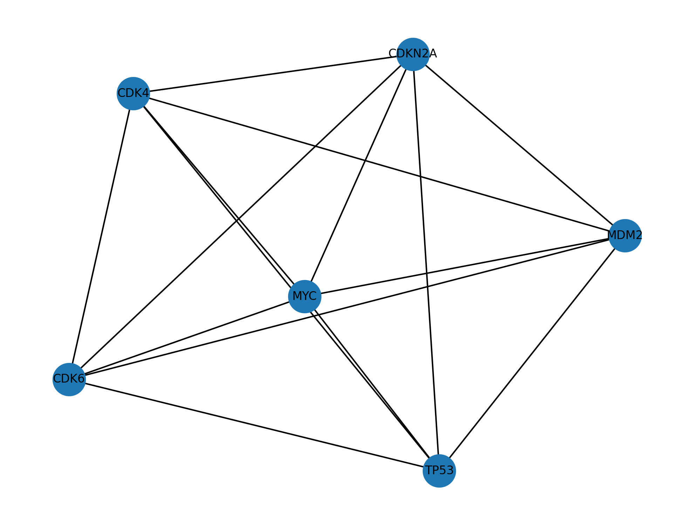

# Showgene

### Description

Showgene is a simple tool to create and visualize gene network with given edge count and node count. It is written in Python and uses [NetworkX](https://networkx.github.io/) library for graph operations and [Matplotlib](https://matplotlib.org/) for visualization. Gene information is obtained from [STRING](https://string-db.org/) database.

### Installation

Showgene requires Python 3.6 or higher. You can install it with pip:

```bash
pip install git+https://github.com/LisenKapusta/Showgene.git
```

### Usage

Showgene can be used as a command line tool or as a Python library.

#### Command line

```bash
usage: showgene [-h] -g GENE [-s SPECIES_ID] [-n NODE_COUNT] [-o OUTPUT]

Show a gene network from the STRING API.

optional arguments:
  -h, --help            show this help message and exit
  -g GENE, --gene GENE  The gene name.
  -s SPECIES_ID, --species_id SPECIES_ID
                        The species ID from NBCI Database. Defaults to 9606.
  -n NODE_COUNT, --node_count NODE_COUNT
                        The number of nodes.
  -o OUTPUT, --output OUTPUT
                        The output file path. Defaults to network.png.
```

#### Example

```bash
showgene -g CDKN2A -n 5 -o CDKN2A_network.png 
```


